# Semantic Segmentation
## Overview

This repository is as part of my Submission to the Project 2: Semantic Segmentation for Self Driving Car Nano Degree Program Term 3.

### Introduction

In this project, a model is created to label the pixels of road in images using a Fully Convolutional Network (FCN). The pre-trained VGG Net is used as a start up for this code and the FCNs are added with Skip layers and Transposed convolutions to update the pixel back with the predicted class (road).

### Setup
##### GPU
`main.py` will check to make sure you are using GPU - if you don't have a GPU on your system, you can use AWS or another cloud computing platform.
##### Frameworks and Packages
Make sure you have the following is installed:
 - [Python 3](https://www.python.org/)
 - [TensorFlow](https://www.tensorflow.org/)
 - [NumPy](http://www.numpy.org/)
 - [SciPy](https://www.scipy.org/)
##### Dataset
Download the [Kitti Road dataset](http://www.cvlibs.net/datasets/kitti/eval_road.php) from [here](http://www.cvlibs.net/download.php?file=data_road.zip).  Extract the dataset in the `data` folder.  This will create the folder `data_road` with all the training a test images.

### Start
##### Implement
The template code in the `main.py` module was already provided by Udacity, where the sections indicated by the "TODO" comments were implemented based on the lecture videos.
##### Run
Run the following command to run the project:
```
python main.py

# Parsers are implemented for epochs and batch size
# To run the code with 5 epochs and 20 batch size.
python main.py --e 5 --b 20
```
**Note** If running this in Jupyter Notebook system messages, such as those regarding test status, may appear in the terminal rather than the notebook.

### Tips

- The link for the frozen `VGG16` model is hardcoded into `helper.py`. The model can be found [here](https://s3-us-west-1.amazonaws.com/udacity-selfdrivingcar/vgg.zip)
- The model is not vanilla `VGG16`, but a fully convolutional version, which already contains the 1x1 convolutions to replace the fully connected layers. Please see this [forum post](https://discussions.udacity.com/t/here-is-some-advice-and-clarifications-about-the-semantic-segmentation-project/403100/8?u=subodh.malgonde) for more information. A summary of additional points, follow.
- The original FCN-8s was trained in stages. The authors later uploaded a version that was trained all at once to their GitHub repo. The version in the GitHub repo has one important difference: The outputs of pooling layers 3 and 4 are scaled before they are fed into the 1x1 convolutions. As a result, some students have found that the model learns much better with the scaling layers included. The model may not converge substantially faster, but may reach a higher IoU and accuracy.

### Results

The below are the results of the network that is trained with 10 Epochs and 10 Batch size.

| RGB Image                                | Model Output                             |
| ---------------------------------------- | ---------------------------------------- |
| 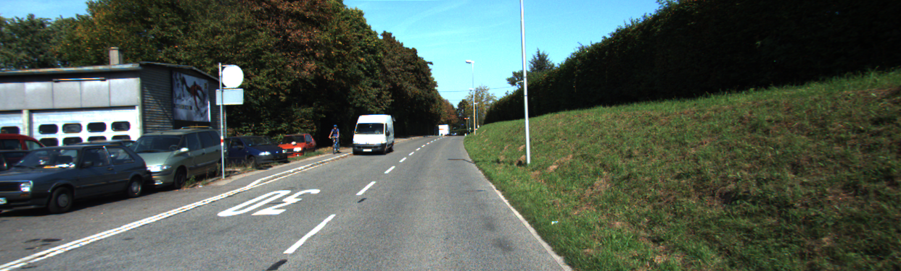{:height="576px" width="170px"} | 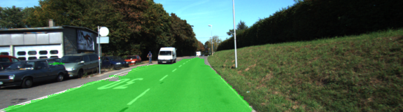 |
| 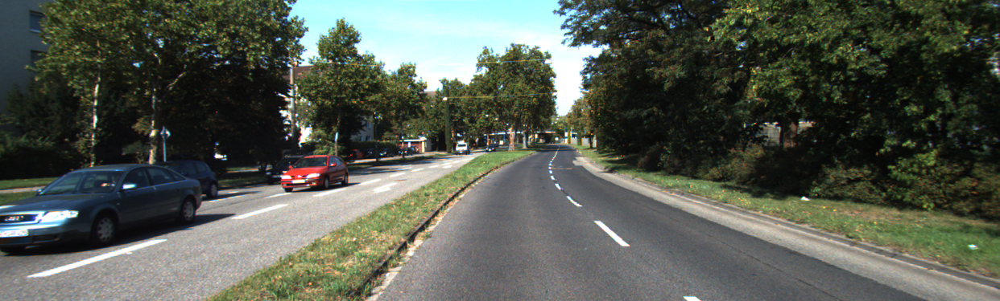{:height="576px" width="170px"} | 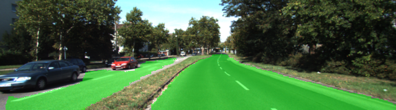{:height="576px" width="170px"} |
| 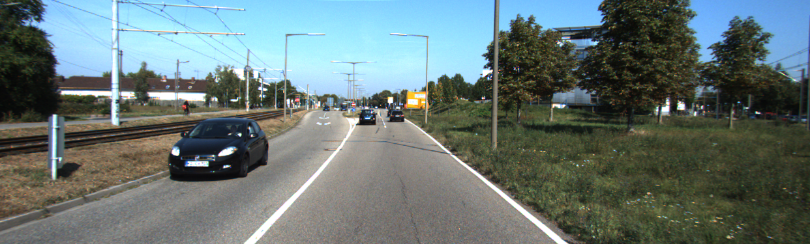{:height="576px" width="170px"} | 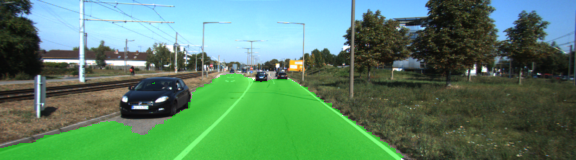{:height="576px" width="170px"} |
| 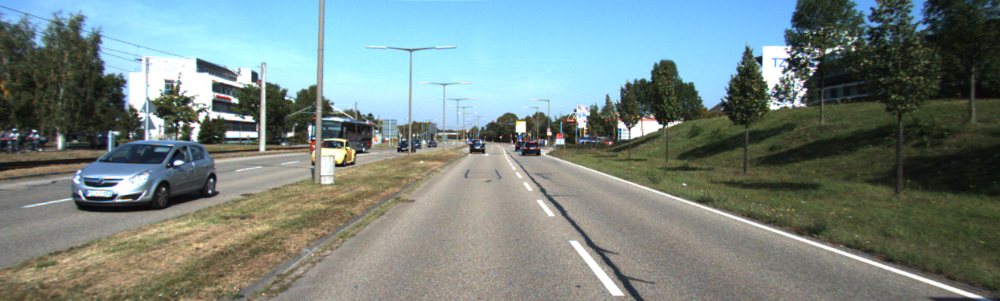{:height="576px" width="170px"} | 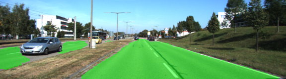{:height="576px" width="170px"} |
| 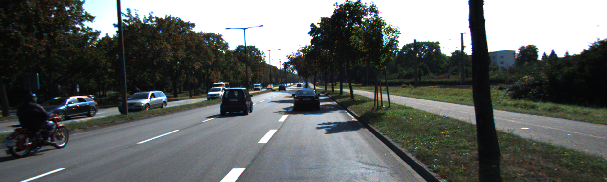{:height="576px" width="170px"} | 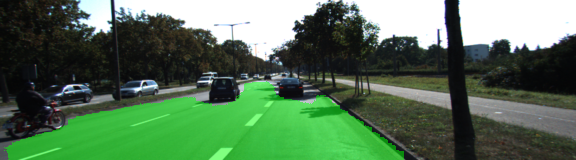{:height="576px" width="170px"} |
| 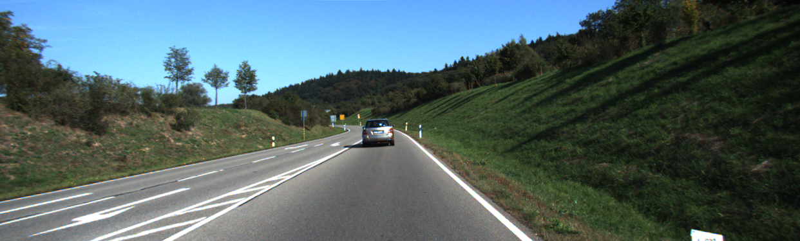{:height="576px" width="170px"} | 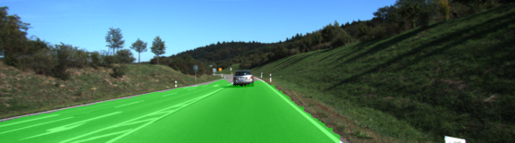{:height="576px" width="170px"} |


